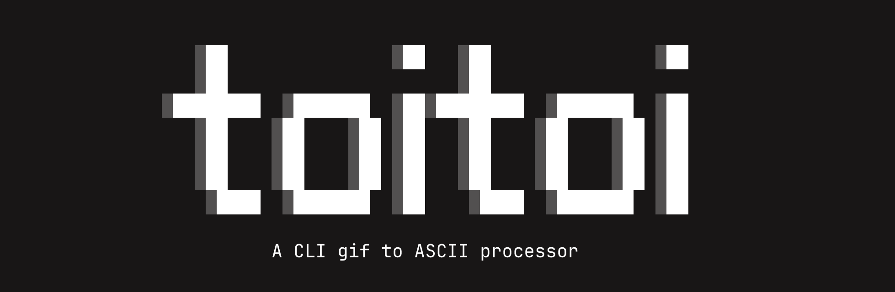

GIF to ASCII Art Converter — A TUI application that converts animated GIF files into ASCII art sequences, exportable as JSON for web or portfolio use.

---

## Installation

```bash
Not yet
```

Requires [Bun](https://bun.sh) as runtime.

## Usage

### Interactive TUI Mode

```bash
bun dev
```

### Demo


Enter a GIF path and press Convert. Navigate frames with ◀ ▶ and toggle post-processing options:

| Key | Effect |
|-----|--------|
| `[+]` | Stencil mode — high contrast binary output |
| `[~]` | Invert — swap background and foreground |
| `[█]` | Retro charset — use ░▒▓█ blocks |
| `[B]` | B&W — pure black and white |
| `[C]` | Contrast — cycles through 1.0 → 1.5 → 2.0 → 2.5 → 3.0 |
| `Export` | Saves JSON to `src/assets/animation/` |

### CLI Mode

```bash
bun run src/convert.ts <archivo.gif>
```

Outputs preview to console and saves JSON to the current directory.

---

## Architecture

```
src/
├── index.tsx          # Main TUI application (OpenTUI + React)
├── ascii-converter.ts # Core conversion module (GIF → ASCII frames)
├── convert.ts         # CLI script wrapper
└── assets/
    └── animation/     # Exported JSON files
```

### Conversion Pipeline

1. **GIF Decoding** — `omggif` decodes frames and handles disposal methods for animated GIFs
2. **Canvas Composition** — Persistent RGBA canvas merges frames according to GIF disposal rules
3. **Pixel → ASCII Mapping** — BT.601 luminance formula converts pixels to character density
4. **Post-processing** — Optional stencil, invert, B&W, and contrast adjustments
5. **Export** — JSON array of `{ascii: string, duration: number}` frames

### State Machine

```
landing → idle → converting → preview ⇄ exported
                  ↓
                error
```

---

## Stack

| Layer | Technology |
|-------|------------|
| Runtime | Bun |
| TUI Framework | OpenTUI (`@opentui/core`, `@opentui/react`) |
| UI Logic | React 19 (hooks) |
| GIF Decoding | `omggif` |
| Image Processing | `jimp`, `sharp`, `@resvg/resvg-js` |
| ASCII Library | `p5.asciify` |

---

## Known Bugs

- **B&W mode index overflow** — When `bw` is enabled, `charIndex` can exceed 1 because `chars.length` may be larger than 2 in non-retro mode, causing incorrect character mapping in `BW_CHARS`

- **Retro invert edge case** — The `invertAscii` function checks `charset === ' ░▒▓█'` but the comparison fails if the charset was passed differently (e.g., with extra spaces or different ordering)

- **Frame timing edge case** — If `frameInfo.delay` is 0 or undefined, all frames default to 30ms regardless of original GIF timing

---

## Current Status

Active development. Core conversion pipeline is functional. TUI interface supports preview, playback, and JSON export. Post-processing options (stencil, invert, B&W, contrast) are implemented but may have edge cases.

Areas needing work:
- Robust error handling for corrupted GIF files
- Unit tests for ascii-converter.ts
- Resolution/quality settings in the TUI